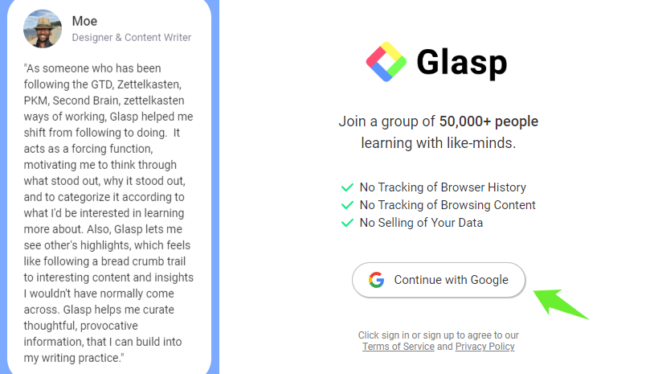
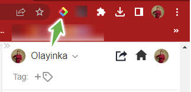

<h1 style='font-size: 3rem; font-weight: bold'>Maximize your Web Browsing Experience with Glasp</h1>

Photo by [Glasp](https://www.glasp.co)

---
### **TABLE OF CONTENTS**
- [**Introduction**](#introduction)
- [**What is Glasp?**](#what-is-glasp)
- [**Why do you need Glasp?**](#why-do-you-need-glasp)
- [**Key Features of Glasp**](#key-features-of-glasp)
- [**How to setup Glasp on your desktop**](#how-to-setup-glasp-on-your-desktop)
- [**How to use Glasp**](#how-to-use-glasp)
- [**How to navigate the Glasp website**](#how-to-navigate-the-glasp-website)
  - [**Home Menu**](#home-menu)
  - [**My Highlights Menu**](#my-highlights-menu)
  - [**Explore Menu**](#explore-menu)
- [**Conclusion**](#conclusion)

---

## **Introduction**  

  Have you ever found yourself reading an online article and wishing you could highlight and save some interesting points for reference? Or maybe you have wanted to share a quote to your social media account pages but didn't want to copy and paste it? That's where you need Glasp. Glasp is a free browser extension that allows you to highlight text on a website, add notes, save those highlights for later and easily share them with friends and colleagues.  
  In this article, we will delve deeper into what Glasp is, why you need Glasp and much more. Whether you're a writer or a reader, Glasp could be the tool you never knew you needed.
  

## **What is Glasp?**
  
   Glasp, an acronym for Greatest Legacy Accumulated as Shared Proof is a free [Chrome Extension](https://chrome.google.com/webstore/detail/glasp-social-web-highligh/blillmbchncajnhkjfdnincfndboieik) that lets you quickly capture online content with colored highlighting options, which are then automatically curated to your Glasp homepage. These highlights can then be tagged, searched for, linked to, and shared on a variety of other platforms, including Twitter, Teams, and Slack.

   According to the [Glasp website](https://glasp.co/about), It is a
    social web highlighter that people can use to highlight and organize quotes and ideas from the web without switching back and forth between screens and accessing other like-minded people’s learning at the same time. Glasp started working on June 2021.
  

## **Why do you need Glasp?**
   
   You need Glasp because: 
- It helps you to quickly and easily highlight important content on web pages.
-  It allows you to share your highlights & notes with friends and peers.
-  It helps to retain information and keep it organized.
-  It helps you to access other like-minded people's learning.
    

## **Key Features of Glasp**
  For you to unlock the power of web browsing with Glasp, it is important to know some features.

1. **Browser Extension**: Glasp is available as a browser extension for Chrome, Firefox, Brave, Edge and Safari.
2. **Highlighting**: Users can highlight text on web pages by selecting the text and clicking the highlighter tool.
3.  **Sharing**: Users can share highlighted pages with friends via email and social media.
4.   **Annotation**: Users can add notes and comments to their highlights, making it easier to fetch and remember where and why they highlighted that particular sentence(s).
5.   **Customization**: Glasp allows users to customize the highlighting tool colors according to their preferences.
6.   **Collaboration**: Users can collaborate on highlights and annotations with others in real time.
7.   **AI-Summary**: Users can easily convert a lengthy article or document into a concise summary.
8.   **YouTube Transcript**: Users can easily highlight youtube videos transcript, and summarize the content of the video.
   
     

   ## **How to setup Glasp on your desktop**
   Here are the simple steps to take to use Glasp on your Desktop using the Chrome browser:
- Open your web browser and visit the [Glasp website](https://glasp.co/).
   
 - Click on the **sign up (beta)** button to create your Glasp account.
  
   
- Click on the **Continue with Google** button to continue your sign-up process using your Google account.
  
   
 - Once you're logged in, click on the **Add to Chrome** button to download and install the Glasp extension.
  
 - After installation, click on the **Extensions** logo at the top right corner of your browser.

   
 - A page that contains all your extensions would pop up. Click on the radio button to enable the Glasp extension.
  
  
- Click on the Extension again at the top right corner to pin the Glasp extension to your browser.
  
  

- Go to your Glasp home page and select your favorite topics.
  
  

- Click on the 3 dots icon to edit your profile. You can also customize your color labels if you want.

  
  

  ## **How to use Glasp**
- Select the sentence(s) you want to highlight on the web page.
  
  
-  From the highlight colors that pop up, select the highlight color of your choice.
  
  !
-  At the top right corner of the browser, click the Glasp Icon to view your highlights which will automatically sync to your account if you are already logged in.
  
  
-  Click on the Home icon to go to your account homepage.
  
-  At the top right corner of your highlight, click on the 3dot icons to add notes, copy, share and delete your highlight.
   

  

## **How to navigate the Glasp website**
There are three main menu items at the top left corner of the Glasp website which will help you navigate the website with ease.

### **Home Menu**

When you log into your Glasp account, the home page is displayed. The home page entails the:

1. **Your Topics**: This section displays your chosen topics.
2. **Recommended Topics**: This section allows you to choose from several topics that might interest you.
3. **Who to follow**: This section suggests people you can follow.
4. **Following**: Glasp displays highlights of the people you follow in this section.
5. **Topics**: Glasp displays highlights and articles that are relevant to your chosen topics.
6. **Popular**: Glasp displays the most liked and glasped highlights in this section.
   
### **My Highlights Menu**

1. **Ask Digital Me**: When you click on this button, you are prompted to type your questions in the chatbot.
2. **Author**: This section displays highlights of anyone that has tagged us as an author.
3. **Article**: Your highlighted articles, notes, comments and dates are displayed here.
4. **Favorite**: This section displays your starred articles.
5. **Saved**: This section displays your saved highlights or articles.
6. **Kindle**: The Kindle feature allows users to export their saved highlights to their Kindle device or app.
7. **Videos**: You can access all your YouTube video highlights in this section.
8. Cloud Icon: Glasp allows you to download all your highlight in Text, CSV, HTML, Markdown, and JSON format.
   
### **Explore Menu**
The Explore menu helps to find content from the community and search for authors or websites.

  

## **Conclusion**
 Glasp helps to maximize the web browsing experience by providing users with a simple yet powerful tool to highlight and save important information from the webpage. With Glasp, users can stay organized and make the most of the information available on the web, helping them become more productive and efficient in their online activities.
